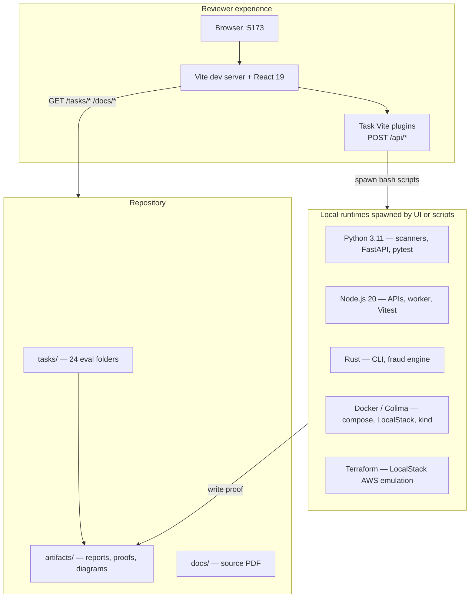
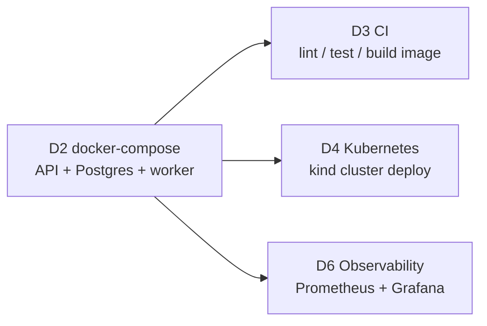

# Coding Agent Evaluation Repository

Self-evaluation workspace for demonstrating coding-agent capabilities across repo discovery, greenfield builds, intermediate operations, advanced parallel work, and DevOps tasks.

**Repository (Bitbucket):** [paytmmoney/pratik_ai_eval](https://bitbucket.org/paytmmoney/pratik_ai_eval)

**Parent ticket (Jira):** [PM4-6626 — Coding Agent Skill Self-Evaluation – Leadership Assignment](https://paytmmoney.atlassian.net/browse/PM4-6626) — tracks 24 subtasks (B1–B6, I1–I6, A1–A6, D1–D6)

**Source spec:** [docs/What-can-you-do-using-a-coding-agent.pdf](docs/What-can-you-do-using-a-coding-agent.pdf)

**Active branch:** `stage` (development); `main` is the stable baseline.

---

## What this project is

This repo is both a **task library** and a **reviewer portal**:

| Layer | Purpose |
|-------|---------|
| `tasks/` | 24 isolated eval exercises (B1–B6, I1–I6, A1–A6, D1–D6), each with README, scripts, and committed proof artifacts |
| `frontend/` | React reviewer app — browse tasks, read deliverables, run live demos that spawn local scripts |
| `scripts/` | Cross-task verification (`verify-all.sh`) |
| `.github/workflows/` | CI pipeline (lint, test, Docker image build) modeled by task D3 |

Every task is **self-contained** under `tasks/<slug>/`. Shared runtime code appears only where a later task intentionally builds on an earlier one (e.g. D4/D6 reuse the D2 job API).

---

## Architecture



### Reviewer web app

The frontend is **not a production deploy target** — it is a local demo harness. Live features depend on Vite dev middleware that runs scripts on the host machine.

| Route | Page |
|-------|------|
| `/` | Task list (manifest from `frontend/public/tasks.json`) |
| `/tasks/:id` | Task detail — README links, artifact preview, live demo panel |
| `/how-it-works/:id` | Architecture walkthrough with Mermaid diagrams |

**Live demo pattern:** each task with a runner registers a Vite plugin in `frontend/vite.config.ts`. The plugin exposes a `POST /api/<task>/…` route that `spawnSync`s the task's shell script and returns stdout + refreshed artifacts. Static files under `/tasks/` and `/docs/` are served directly from the repo root during `npm run dev`.

### Shared service spine (D2 job queue)

Several DevOps tasks build on the same FastAPI job-queue stack:



| Service | Port | Stack |
|---------|------|-------|
| D2 job API | 8090 | FastAPI, Postgres 16, background worker |
| D6 Grafana | 3000 | Provisioned dashboard on instrumented D2 API |
| D6 Prometheus | 9090 | Scrapes `/metrics` from D2 API |
| A3 FastAPI ingress | 8780 | Fraud-score events (standalone polyglot system) |
| A3 Node worker | 8781 | Calls Rust engine |
| A3 Rust engine | 8782 | Deterministic score computation |
| D1 LocalStack | 4566 | S3 + Lambda + API Gateway (Terraform plan target) |

**Port note:** only one stack should bind `:8090` at a time — stop D2 before running D6 verify, or vice versa.

---

## Tech stack

### Languages & runtimes

| Technology | Version | Where used |
|------------|---------|------------|
| **Python** | 3.11 (mise) | B1–B4 scanners/services, D2 API/worker/e2e, I4 API, A3/A4/A5/A6, task scripts |
| **Node.js** | 20 (mise) | B5 API, A3 worker, reviewer frontend, Vitest |
| **TypeScript** | 5.x | Reviewer UI, B5, A3 worker |
| **Rust** | stable (cargo) | B6 log counter CLI, A3 fraud engine |
| **SQL** | Postgres 16 | D2/D4/D6 job queue persistence |

### Frontend (reviewer portal)

| Package | Role |
|---------|------|
| React 19 + React Router 7 | SPA shell, task routing |
| Vite 6 | Dev server, build, custom middleware plugins |
| Vitest + jsdom | 160+ unit tests for components and plugin contracts |
| Mermaid 11 | ER diagrams, sequence charts, architecture views in UI |

### Backend & infrastructure patterns

| Area | Tools |
|------|-------|
| HTTP APIs | FastAPI, Express-style Node handlers |
| Testing | pytest, Vitest, cargo test, Playwright-style e2e (D2) |
| Containers | Docker Compose, multi-stage Dockerfiles (I5, D2) |
| CI/CD | GitHub Actions, `act` local runner (D3) |
| IaC | Terraform + LocalStack (D1) |
| Orchestration | Kubernetes manifests on kind (D4) |
| Observability | JSON structured logs, Prometheus metrics, Grafana dashboards (D6) |
| Tool pinning | mise (`.mise.toml`), Makefile bootstrap (D5) |
| Lint | ruff (Python, `pyproject.toml`), npm ci smoke (frontend) |

### External repo scanning (B1, B2)

B1 and B2 can scan **local paths** or clone **Bitbucket URLs** at runtime to produce inventory reports and API endpoint maps — useful for evaluating agent repo-reading skills on unfamiliar codebases.

---

## Repository layout

```
pratik_ai_eval/
├── docs/                    # Source PDF and reference material
├── frontend/                # Reviewer web app
│   ├── public/tasks.json    # Task manifest (categories, status, artifact paths)
│   ├── src/                 # React pages, live demo components, types
│   └── vite-plugin-*.ts     # One plugin per runnable task (spawn local scripts)
├── tasks/                   # One folder per eval task
│   └── <slug>/
│       ├── README.md        # Goal, time box, run instructions
│       ├── artifacts/       # Generated proof (reports, logs, diagrams)
│       ├── src/             # Task code (when applicable)
│       └── scripts/         # verify.sh, e2e.sh, etc.
├── scripts/
│   └── verify-all.sh        # Aggregate verification across tasks
├── .github/workflows/ci.yml # Lint + test + Docker build (D3 reference impl)
├── .mise.toml               # Pinned Node 20 + Python 3.11
├── Makefile                 # bootstrap / test / lint targets (D5)
├── pyproject.toml           # ruff config for Python lint
├── README.md                # This file
└── REVIEWER.md              # Detailed reviewer / verification guide
```

---

## Task index

All tasks are **done**. Each has a dedicated README under `tasks/<slug>/`.

| ID | Category | Task | Verification |
|----|----------|------|--------------|
| B1 | Basics | Repo artifact inventory | Live UI scan or Python CLI |
| B2 | Basics | API endpoint map | Live UI scan or Python CLI |
| B3 | Basics | Test discovery and execution | Live UI + pytest proof |
| B4 | Basics | FastAPI greenfield service | Live UI + tests |
| B5 | Basics | Node.js greenfield API | Live UI + Vitest |
| B6 | Basics | Rust greenfield CLI | Live UI + cargo test |
| I1 | Intermediate | ER diagram from repo | Live UI + Mermaid artifact |
| I2 | Intermediate | End-to-end flow trace | Live UI + sequence diagram |
| I3 | Intermediate | Small safe change | Live UI + patch artifact |
| I4 | Intermediate | Polyglot FastAPI + Node | Live UI + dual test suites |
| I5 | Intermediate | Dockerize and run | Live UI + Docker verify |
| I6 | Intermediate | Bug diagnosis | Live UI + fix proof |
| A1 | Advanced | Multi-worktree parallel plan | Artifacts-only (plan doc) |
| A2 | Advanced | Execute two parallel worktrees | Live UI + sandbox merge |
| A3 | Advanced | Polyglot mini-system | e2e script + live UI |
| A4 | Advanced | Repository modernization | Live UI + legacy sandbox |
| A5 | Advanced | Agent code review | Live UI + adversarial tests |
| A6 | Advanced | Performance profiling | Live UI + benchmark script |
| D1 | DevOps | Terraform + LocalStack | Live UI + terraform plan |
| D2 | DevOps | docker-compose + E2E | Live UI + e2e script |
| D3 | DevOps | CI pipeline | Live UI + local CI / act |
| D4 | DevOps | Kubernetes on kind | Live UI + kubectl verify |
| D5 | DevOps | Reproducible dev environment | Live UI + `make bootstrap` |
| D6 | DevOps | Observability bolt-on | Live UI + Prometheus/Grafana |

### Category goals (project knowledge)

| Category | What it proves |
|----------|----------------|
| **Basics (B)** | Read unfamiliar repos, map structure/endpoints/tests, ship small greenfield services in Python, Node, and Rust |
| **Intermediate (I)** | Diagram domains, trace flows, make surgical changes, connect polyglot services, containerize, diagnose bugs |
| **Advanced (A)** | Plan parallel agent work (A1), execute multi-worktree delivery (A2), run three-language systems (A3), modernize legacy code (A4), adversarial review (A5), profile and optimize (A6) |
| **DevOps (D)** | IaC planning (D1), multi-service compose (D2), CI pipelines (D3), K8s manifests (D4), reproducible onboarding (D5), metrics/logs/dashboards (D6) |

---

## Getting started

### Prerequisites

Install only what you need for the tasks you plan to review:

| Tool | Required for |
|------|--------------|
| **mise** | D5 bootstrap, pinned Node/Python |
| **Node.js 20** | Reviewer UI |
| **Python 3.11** | Most task scripts |
| **Rust (cargo)** | B6, A3 engine |
| **Docker / Colima** | I5, D1 LocalStack, D2–D4, D6 |
| **kubectl + kind** | D4 |
| **Terraform** | D1 |

### Quick bootstrap (fresh clone)

```bash
brew install mise          # one-time
eval "$(mise activate bash)"
make bootstrap             # install deps + run ruff, pytest, vitest
```

### Start the reviewer UI

```bash
cd frontend
npm install
npm run dev
```

Open **http://localhost:5173** — browse tasks, open READMEs, run live demos.

For **B1**, open task B1 → **Use example URL** → run the live inventory scan against a public Bitbucket repo.

For **D6 Grafana**, ensure Docker/Colima is running (`colima start`), then use **Start stack** on the D6 page or:

```bash
bash tasks/d6-observability-bolt-on-with-metrics-and-a-dashboard/scripts/up.sh
# Dashboard: http://localhost:3000/d/d6-job-api/d6-job-api
```

### Full verification

```bash
bash scripts/verify-all.sh
```

Skips Docker-dependent steps gracefully when Docker is unavailable. See [REVIEWER.md](REVIEWER.md) for per-task commands and verification modes (live UI vs script-only vs artifacts-only).

---

## CI

`.github/workflows/ci.yml` runs on every push/PR:

1. **lint** — ruff on D2 Python sources; `npm ci` smoke on frontend
2. **test** — pytest (D2 API/worker), Vitest (frontend), cargo test (where applicable)
3. **build** — Docker image build for the D2 API (same pattern documented in D3)

---

## Key design decisions

1. **Artifacts are the proof** — every runnable task commits output under `artifacts/` so reviewers can verify without re-running, while live demos allow re-execution.
2. **Vite plugins, not a backend server** — keeps the reviewer app simple; each task owns its scripts; the UI only orchestrates.
3. **D2 as shared spine** — one realistic job-queue API reused across container, CI, K8s, and observability tasks instead of four unrelated sample apps.
4. **Local-first DevOps** — LocalStack, Colima, and kind avoid cloud credentials while still demonstrating real tooling.
5. **Strict task isolation** — each eval folder is independently understandable; cross-task imports are explicit and documented.

---

## Further reading

- [REVIEWER.md](REVIEWER.md) — prerequisites, verification modes, D1/D4/D5/D6 specifics
- [frontend/public/tasks.json](frontend/public/tasks.json) — machine-readable task manifest
- Individual task READMEs under `tasks/*/README.md`
