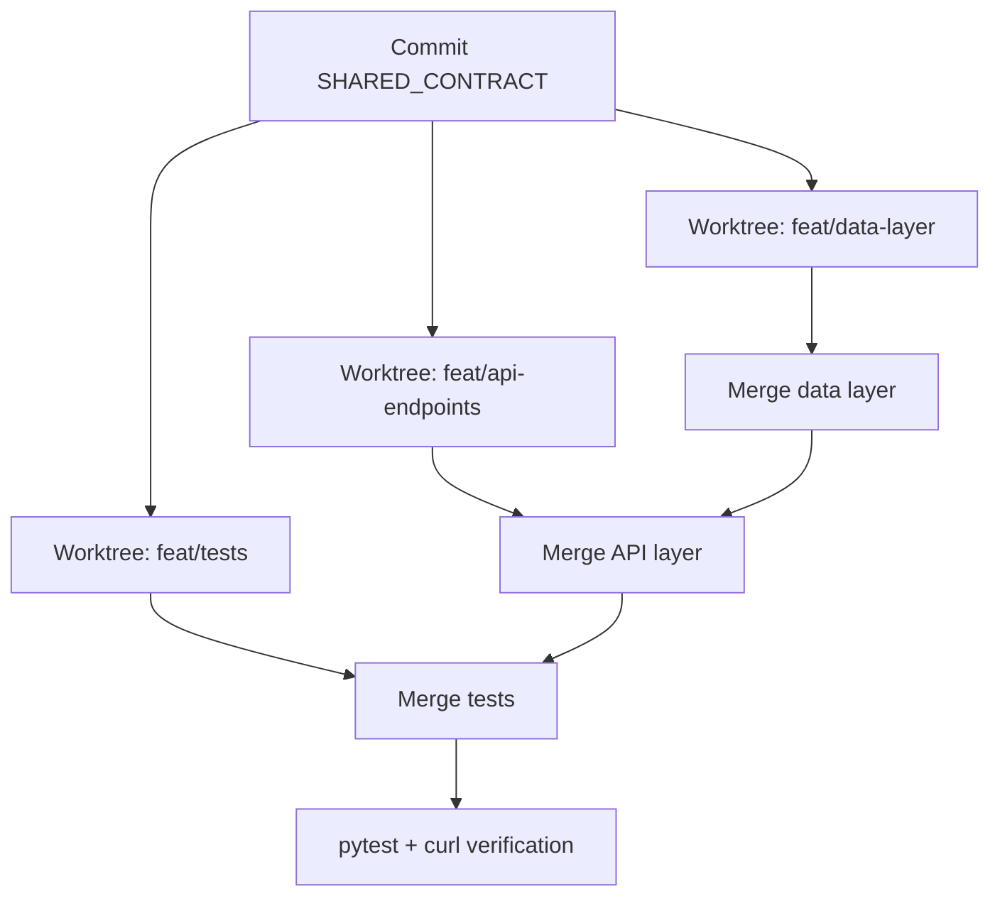

# A1 — Multi-Worktree Parallel Plan

**Time box:** 45 minutes  
**Status:** Done

## Goal

Demonstrate **parallel agent supervision**: take one feature task, split it safely into parallel git worktrees (or agent sessions), and document how to merge without chaos.

This is a **planning-only** eval task. The deliverable is the documented strategy — not shipping production code inside this folder.

## Example feature (subject of the plan)

**Expense Tracker REST API** — FastAPI + SQLite with:

- `POST /transactions`
- `GET /transactions`
- `GET /balance`

## What A1 proves

| Skill | Evidence |
|-------|----------|
| Task decomposition | Three lanes by file ownership (data / API / tests) |
| Worktree isolation | Sibling directories, one branch per lane |
| Agent prompts | Copy-paste instructions with must-not-touch rules |
| Shared constraints | Frozen contract + 7 global rules |
| Merge discipline | Ordered merge: data → api → tests |
| Risk management | Conflict table + resolution playbook |
| Verification gates | Per-lane checks + post-merge pytest/curl plan |

## Deliverables

| Artifact | Description |
|----------|-------------|
| [artifacts/parallel-plan.md](artifacts/parallel-plan.md) | Full plan: decomposition, worktrees, prompts, constraints, merge order, risks, verification |
| [artifacts/shared-contract.md](artifacts/shared-contract.md) | Frozen data model and API contract (commit before lanes start) |
| [artifacts/supervisor-checklist.md](artifacts/supervisor-checklist.md) | 45-minute live demo runbook |
| [artifacts/run-proof.txt](artifacts/run-proof.txt) | Optional example output from executing the plan locally |

## How it works (supervisor flow)



1. **Contract first** — merge `SHARED_CONTRACT.md` before any parallel lane.
2. **Three worktrees** — `feat/data-layer`, `feat/api-endpoints`, `feat/tests` in separate directories.
3. **Directory ownership** — each lane may only edit its owned paths (see parallel-plan.md).
4. **Merge in order** — data → api → tests (routes depend on models; tests depend on app).
5. **Verify after each merge** — catch breakage before the next merge.

## Worktrees and branches (example)

| Worktree directory | Branch | Owns |
|--------------------|--------|------|
| `expense-tracker-data` | `feat/data-layer` | `app/models.py`, `app/database.py`, `app/config.py` |
| `expense-tracker-api` | `feat/api-endpoints` | `app/routes/`, `app/main.py`, `app/schemas.py` |
| `expense-tracker-tests` | `feat/tests` | `tests/` |

## Reviewer UI

```bash
cd frontend && npm run dev
```

Open http://localhost:5173 → task **A1** for architecture details, pipeline steps, and links to artifacts.

## Verification checklist

- [x] Task decomposition documented
- [x] Worktree and branch names documented
- [x] Agent prompt for each lane (3 prompts)
- [x] Shared constraints (7 rules + frozen contract)
- [x] Merge order with rationale
- [x] Conflict/risk plan with mitigations
- [x] Verification plan (per-lane + integration gates)
