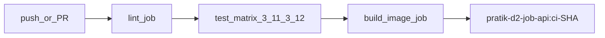

# D3 — CI Pipeline that Lints, Tests, and Builds an Image

**Time box:** 45 minutes  
**Status:** Done

## Goal

GitHub Actions workflow on every push that lints Python sources, runs tests (with Python matrix), builds and tags the D2 API container image, plus local `act` scripts and a failure demo.

## Pipeline



| Job | What it does |
|-----|--------------|
| **lint** | `ruff check` on D2 API + worker; `npm ci` smoke on frontend |
| **test** | Matrix Python 3.11 / 3.12 → D2 API pytest; frontend `npm test` on 3.11 leg |
| **build** | `docker/build-push-action` builds D2 API image, tags `ci-${{ github.sha }}`, GHA layer cache |

Workflow file: [`.github/workflows/ci.yml`](../../.github/workflows/ci.yml) (repo root — required for GitHub Actions / `act`).

## Quick verify

### Option A — local CI steps (no act required)

```bash
bash tasks/d3-ci-pipeline-that-lints-tests-and-builds-an-image/scripts/run-local-ci.sh
```

### Option B — full GitHub Actions simulation with act

```bash
brew install act
bash tasks/d3-ci-pipeline-that-lints-tests-and-builds-an-image/scripts/run-act.sh
```

Writes [`artifacts/ci-run-log.txt`](artifacts/ci-run-log.txt).

### Failure mode demo

```bash
bash tasks/d3-ci-pipeline-that-lints-tests-and-builds-an-image/scripts/demo-ci-failure.sh
```

Injects an unused import into D2 API, runs `act` lint job (or `ruff` locally), captures [`artifacts/ci-failure-log.txt`](artifacts/ci-failure-log.txt), restores the file.

## Cache and matrix

| Feature | Config |
|---------|--------|
| **pip cache** | `actions/setup-python` with `cache: pip` |
| **npm cache** | `actions/setup-node` with `cache: npm` |
| **Docker cache** | `docker/build-push-action` `cache-from/to: type=gha` |
| **Matrix** | `python-version: [3.11, 3.12]` on test job |

## CI test targets

- **Lint:** D2 `api/src`, `worker/src` via ruff ([`pyproject.toml`](../../pyproject.toml))
- **Unit tests:** D2 `api/tests/` (mocked DB, no Postgres required)
- **Frontend tests:** `frontend` vitest (135 tests)
- **Image build:** D2 [`api/Dockerfile`](../d2-docker-compose-stack-from-scratch-with-end-to-end-tests/api/Dockerfile)

## Deliverables

| File | Purpose |
|------|---------|
| [`.github/workflows/ci.yml`](../../.github/workflows/ci.yml) | GitHub Actions workflow |
| [`pyproject.toml`](../../pyproject.toml) | Ruff configuration |
| [`api/tests/`](../d2-docker-compose-stack-from-scratch-with-end-to-end-tests/api/tests/) | D2 API unit tests for CI |
| [`scripts/run-act.sh`](scripts/run-act.sh) | Local green pipeline via act |
| [`scripts/run-local-ci.sh`](scripts/run-local-ci.sh) | Local green pipeline without act |
| [`scripts/demo-ci-failure.sh`](scripts/demo-ci-failure.sh) | Deliberate lint failure demo |
| [`artifacts/ci-run-log.txt`](artifacts/ci-run-log.txt) | Passing run proof |
| [`artifacts/ci-failure-log.txt`](artifacts/ci-failure-log.txt) | Failing lint proof |

## Reviewer UI

```bash
cd frontend && npm run dev
```

Open task **D3** — view CI logs and re-run local CI from the browser.

## Note on Bitbucket remote

This repo pushes to **Bitbucket**; GitHub Actions does not run automatically there. Use **`act`** locally or mirror to GitHub for hosted runs. Local proof artifacts satisfy the eval requirement.

## Prerequisites

- **act** (optional): `brew install act`
- **Docker** (for build job / act)
- **Python 3.11+** and **Node 20+**
